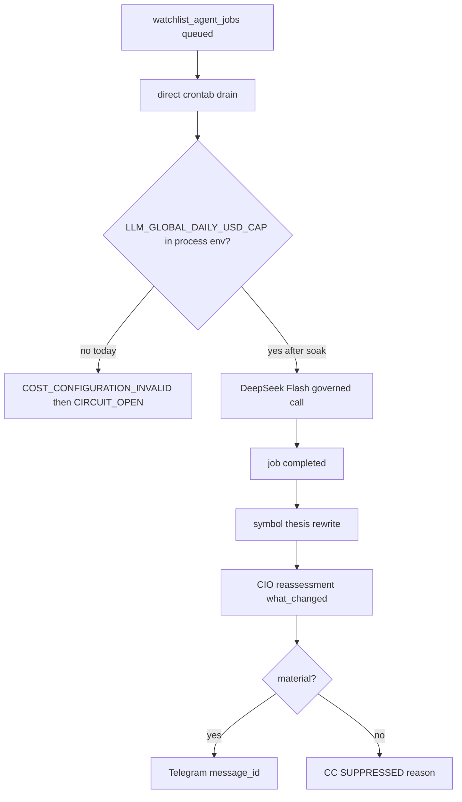

# Close remaining operator gaps to 100%

Date: 2026-08-19  
Status: HISTORICAL PLAN + 2026-08-19 CONVERGENCE RECONCILIATION  
Authority: READ_ONLY_ADVISORY (no broker / order / stop / risk / 2FA mutation)

## Reconciliation (2026-08-19, after protected main `25a1a34a`)

The body below was written while #397/#398/#399/#400 were still in flight. Treat those
"draft / not-main / NOT LIVE" sentences as **history**. Current source-of-truth:

| PR | Merge SHA | Status |
|----|-----------|--------|
| #400 | `1dfa064b786754c386a52f123194f74a058e6034` | Merged to protected main |
| #398 | `36dd1c4b939834d9beb92accb3234788533f369c` | Merged to protected main |
| #399 | `0db697cbcb9c8d0af65ce5918ec165e1b352c1d7` | Merged to protected main |
| #397 | `25a1a34a49feecb659080e8e13788381498c03f7` | Merged to protected main (R7.1 living thesis + Command Center) |

Automatic queued intelligence is **DeepSeek Flash FIRST** via existing `llm_router`.
Maria `_prefer_maria_oauth()` no longer preempts the router for holdings/WAIT/auto queue.
OAuth remains for explicit challenge / manual / soft Flash fallback.
Queue control is dedupe/supersede/stale/backpressure — not raising `--limit`.
`LLM_GLOBAL_DAILY_USD_CAP` remains the operator cap (value not logged). Soak $2 is SOAK_DEFAULT only.

Remaining work is **deploy exact main** via immutable release + natural-run soak, not another architecture layer.

Related PRs (do not merge `feat/two-way-watchlist-curation`):

| PR | Role | Merge now? |
|----|------|------------|
| #398 `fix/watchlist-source-remediation-mainline` | Watchlist/source/RAG matcher | Merged 2026-08-19 (`36dd1c4b`) |
| #399 `fix/watchlist-agent-jobs-cron-env` | flock `env` form | Merged 2026-08-19 (`0db697cb`) |
| #400 `fix/watchlist-agent-jobs-overnight-cap` | Bulk DeepSeek window + soak drain | Merged 2026-08-19 |
| #397 `wt/symbol-thesis-universe` | R7.1 living thesis + CC card | **Merged** `25a1a34a` (2026-08-19) |

---

## Assessment

The plumbing is mostly connected and fail-closed. Remaining problems are integration, operator visibility, and one hard autonomous-research blocker.

| Layer | Status | Meaning |
|-------|--------|---------|
| Watchlist discovery / social / SearXNG | LIVE | Candidates and social signals flowing |
| Watchlist curation | LIVE | Governed auto-apply; not investment conviction |
| RAG embeddings | LIVE / healthy | 807k+ embeddings; `NOT_SCHEDULED` is a monitor bug fixed in #398 |
| CIO research→reassessment | LIVE | Completion → reassessment → product → `what_changed` |
| Watchlist-agent worker | RUNNING | Live `flock` syntax fixed |
| Autonomous agent-job completion | BROKEN / FAIL-CLOSED | Missing `LLM_GLOBAL_DAILY_USD_CAP` on direct cron; then circuit opens |
| Symbol living thesis | **IN MAIN** (`25a1a34a`) | SCHG/CSCO/ANET canary still needs production deploy of this SHA |
| Command Center living-thesis UI | **IN MAIN** | UNIVERSE & THESES tab is in Command Center source; live host may still run older CURRENT |
| Interactive Telegram | YES | `/cio`, `/advisory`, `rag`, `ask`, watch commands |
| Proactive CIO Telegram | ARCHITECTURE EXISTS | Silence ≠ proof; need `message_id` or visible SUPPRESSED |

**Cost blocker (degree, not direction):** the drain never *sees* the cap. Direct crontab lines never source `LLM_GLOBAL_DAILY_USD_CAP`. Systemd units pin **0.50**. Process registry allows Maria **2.00**/day. `validate_paid_cap_config(require_global=True)` raises `COST_CONFIGURATION_INVALID`. Circuit trips at 8 in-process errors. Correct fail-closed.

**DeepSeek off hours:** not the retired local-gemma window (`run_deep_overnight_llm_window.sh`, PHASE102-RETIRED). Official Flash peak is **01:00–04:00 and 06:00–10:00 UTC** (`scripts/hermes_llm_failover.py`). In ET that is ~**21:00–00:00** and **02:00–06:00**. Current night lines (`*/5 20-23` and `*/5 0-5`) overlap peak. Off-peak overnight gap is roughly **00:00–02:00 ET**.



**Chosen policy:** temporarily raise/relax the global daily cap on the **overnight DeepSeek lane only**, measure spend, then lock a real cap. Do **not** skip `require_global` globally.

Soak (execute-time): overnight-only `LLM_GLOBAL_DAILY_USD_CAP=2.00` (matches `watchlist_maria_flash_narrative`). Keep market-hours drain at **0.50** once env is present, or leave market drain fail-closed until soak data exists. Never put API keys on crontab; source `~/.config/tradeai/agent-operator.env` + `/run/user/$(id -u)/tradeai/env` the way `scripts/run_governed_agent_flash_market.sh` already does.

---

## Phase 0 — Finish line

Success is the SCHG card (role, thesis vN, why own/watch, case, counter, gaps, research running/completed, what changed, CIO action, next review) plus either a Telegram `message_id` or a visible `SUPPRESSED` reason.

---

## Phase 1 — Unstick autonomous research (P0)

1. Overnight drain wrapper (pattern of governed market wrapper, **not** `--scheduled-canary`):
   - Source operator env + tmpfs env (no secret print).
   - Require numeric `LLM_GLOBAL_DAILY_USD_CAP` (soak **2.00**; log SOAK not measured).
   - `AGENT_JOBS_LOCK_HELD_EXTERNALLY=1`, flock `/tmp/tradeai_watchlist_agent_jobs.lock`.
   - `process_watchlist_agent_jobs.py --limit 8`.
   - Refuse DeepSeek peak. Preferred schedule: `*/15 0-1 * * 1-6` (00:00–02:00 ET).
   - Leave market `*/15 6-19` as-is until soak proves spend.
2. Live cron (narrow): point **only** overnight/weekend agent-job lines at the wrapper. Backup + hash + diff.
3. Monitor 3–5 off-peak nights: `llm_cost_reservations`, `/api/v2/consumption/overview`, job counts, p50/p95 $ per job. Then lock the real cap.
4. Source PR: `fix/watchlist-agent-jobs-overnight-cap` (do not bundle into #398/#399).

---

## Phase 2 — Mainline reconciliation

1. Undraft + merge **#398**.
2. Undraft + merge **#399**.
3. Retarget `config/r71_cursor_dependency.json` on #397 from `e683e90f` → **#398 / `6e429619`**. Do not merge #397 here.

---

## Phase 3 — Research → thesis (after completions exist)

Gated canary backfill **SCHG / CSCO / ANET only**. Enqueue budgeted RI for T0/T1. Fill `active_research` from the real queue. Keep auto `@vN` forbidden on wake.

---

## Phase 4 — Command Center SCHG card

- UNIVERSE & THESES tab on `CioHub.tsx` from `GET /api/v3/cio/universe-theses`.
- `SymbolThesisCard` from `GET /api/v3/cio/symbol-thesis/{SYM}`.
- Render `operator_trust.notification` + `suppression_reason` on CIO NOW.
- `/cio thesis SCHG` → `ask_cio_symbol_context`.

---

## Phase 5 — Prove proactive Telegram or suppression

Wire `_notify` to enqueue outbox **only** for material product `what_changed`. Keep CIO token, interdiction, fail-closed credentials. Live delivery still needs separate `AUTHORIZE_P2_LIVE_OPERATOR_DELIVERY`.

---

## Phase 6 — Productionize #397 last

Soak: completions + spend nights + CC card for 3 symbols + one notify or one suppression. Then undraft #397. Bounded canary remains advisory, not trade.

---

## Will not do

- Broker / order / stop / risk / 2FA mutation
- Merge #397 in the same breath as the cost soak
- Skip `require_global` on all paid Flash
- Restore old crontab backup (self-deadlock) or re-merge `feat/two-way-watchlist-curation`

---

## Implementation notes (2026-08-19)

### Phase 1 — merged as PR #400

- Wrapper `scripts/run_watchlist_agent_jobs_offpeak.sh` sources operator + tmpfs env, soak-defaults `LLM_GLOBAL_DAILY_USD_CAP=2.00` on this lane only when unset/non-positive, PEAK_SKIPs outside **10:00–21:00 America/New_York** (and official UTC pricing peaks). Override `HERMES_ALLOW_DEEPSEEK_PEAK=1` is as-needed only. Flock `/tmp/tradeai_watchlist_agent_jobs.lock` with `AGENT_JOBS_LOCK_HELD_EXTERNALLY=1`, drain `--limit 8`.
- Helper `scripts/lib/deepseek_offpeak.py`. Spend JSON: `scripts/report_agent_jobs_spend_soak.py --json`.
- Hermes Flash apply (`hermes_llm_failover.is_deepseek_offpeak`) uses the same 10:00–21:00 ET bulk gate.
- Intended live line (host TZ already Eastern):

```
*/15 10-20 * * * $PROJ/scripts/run_watchlist_agent_jobs_offpeak.sh >> $PROJ/logs/watchlist_agent_jobs_offpeak.log 2>&1
```

`10-20` is 10:00 a.m. through 8:59 p.m. Eastern (last tick before 9 p.m.). **Not** midnight. Midnight `0-1` was incorrect. Market `*/15 6-19 --limit 20` is bulk before 10 a.m. and should be commented; the 1-call governed Flash wrapper may remain as as-needed.

### Watchlist source + cron env — merged as PR #398 and PR #399

Operator authorized merge after #400. RAG matcher and flock `env` form are on `main`.

### Phases 2–5 — `wt/symbol-thesis-universe` (PR #397)

Phases 3–5 product plumbing on this branch. Operator authorized merge after green frontend CI (design-guard: do not write `#397` in copy).

- `config/r71_cursor_dependency.json` declares PR **#398** head `6e429619` (`cursor_pr: 398`). Data-plane consume only; no wholesale merge of `feat/two-way-watchlist-curation`.
- `build_symbol_thesis_card` fills `active_research` / `recent_completed_research` from `watchlist_agent_jobs` (empty if DB unavailable). Gated canary helper `scripts/publish_symbol_thesis_canary.py` is **default dry**; `--apply` requires `CANARY_THESIS_APPLY=1`. Auto `@vN` on wake remains forbidden.
- Command Center `UNIVERSE & THESES` tab + `SymbolThesisCard`. CIO NOW trust strip shows `operator_trust.notification` class **and** `suppression_reason`.
- `_notify` enqueues `NotificationOutbox` for **material product `what_changed` only**. Thesis-version-only bumps do not enqueue. Delivery worker not switched to live. `AUTHORIZE_P2_LIVE_OPERATOR_DELIVERY` remains unset.
