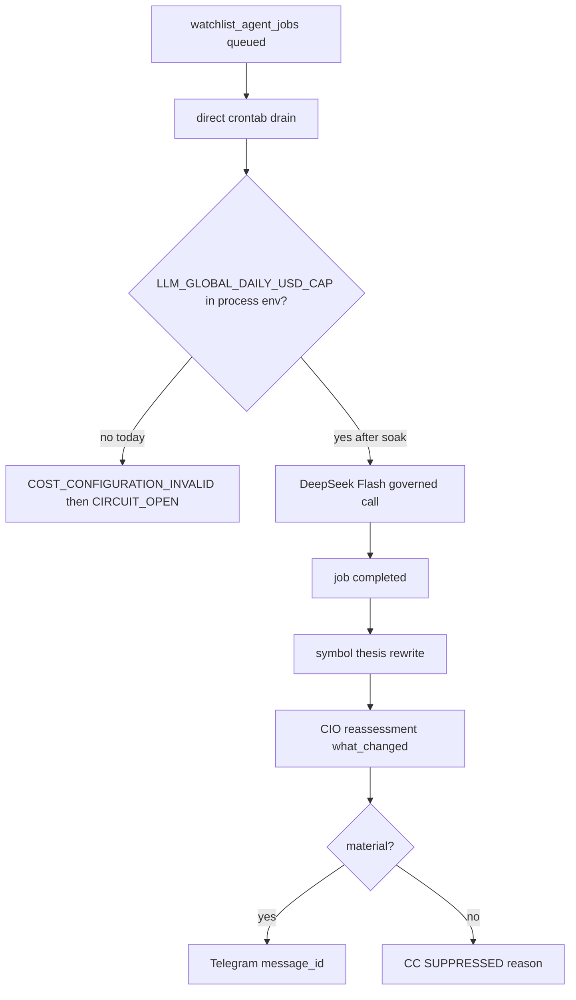

# Close remaining operator gaps to 100%

Date: 2026-08-19  
Status: PLAN + IN IMPLEMENTATION  
Authority: READ_ONLY_ADVISORY (no broker / order / stop / risk / 2FA mutation)

This is the operator-facing plan to close the last 15–20% of the experience: autonomous research completion, mainline reconciliation, living-thesis product, Command Center SCHG card, and proven CIO Telegram (or proven suppression).

Related PRs (do not merge `feat/two-way-watchlist-curation`):

| PR | Role | Merge now? |
|----|------|------------|
| #398 `fix/watchlist-source-remediation-mainline` @ `6e429619` | Watchlist/source/RAG matcher | Operator undraft + merge first |
| #399 `fix/watchlist-agent-jobs-cron-env` @ `d407b13d` | flock `env` form | Operator undraft + merge second |
| #397 `wt/symbol-thesis-universe` @ `65fc1c9f` | R7.1 living thesis backend | Keep draft until soak + CC card + notify proof |

---

## Assessment

The plumbing is mostly connected and fail-closed. Remaining problems are integration, operator visibility, and one hard autonomous-research blocker.

| Layer | Status | Meaning |
|-------|--------|---------|
| Watchlist discovery / social / SearXNG | LIVE | Candidates and social signals flowing |
| Watchlist curation | LIVE | Governed auto-apply; not investment conviction |
| RAG embeddings | LIVE / healthy | 807k+ embeddings; `NOT_SCHEDULED` is a monitor bug fixed in #398 |
| CIO research→reassessment | LIVE | Completion → reassessment → product → `what_changed` |
| Watchlist-agent worker | RUNNING | Live `flock` syntax fixed |
| Autonomous agent-job completion | BROKEN / FAIL-CLOSED | Missing `LLM_GLOBAL_DAILY_USD_CAP` on direct cron; then circuit opens |
| Symbol living thesis | BUILT IN #397, NOT LIVE | SCHG/CSCO/ANET logic on branch only |
| Command Center living-thesis UI | NOT COMPLETE | #397 is backend-only |
| Interactive Telegram | YES | `/cio`, `/advisory`, `rag`, `ask`, watch commands |
| Proactive CIO Telegram | ARCHITECTURE EXISTS | Silence ≠ proof; need `message_id` or visible SUPPRESSED |

**Cost blocker (degree, not direction):** the drain never *sees* the cap. Direct crontab lines never source `LLM_GLOBAL_DAILY_USD_CAP`. Systemd units pin **0.50**. Process registry allows Maria **2.00**/day. `validate_paid_cap_config(require_global=True)` raises `COST_CONFIGURATION_INVALID`. Circuit trips at 8 in-process errors. Correct fail-closed.

**DeepSeek off hours:** not the retired local-gemma window (`run_deep_overnight_llm_window.sh`, PHASE102-RETIRED). Official Flash peak is **01:00–04:00 and 06:00–10:00 UTC** (`scripts/hermes_llm_failover.py`). In ET that is ~**21:00–00:00** and **02:00–06:00**. Current night lines (`*/5 20-23` and `*/5 0-5`) overlap peak. Off-peak overnight gap is roughly **00:00–02:00 ET**.

**Chosen policy:** temporarily raise/relax the global daily cap on the **overnight DeepSeek lane only**, measure spend, then lock a real cap. Do **not** skip `require_global` globally.

Soak (execute-time): overnight-only `LLM_GLOBAL_DAILY_USD_CAP=2.00` (matches `watchlist_maria_flash_narrative`). Keep market-hours drain at **0.50** once env is present, or leave market drain fail-closed until soak data exists. Never put API keys on crontab; source `~/.config/tradeai/agent-operator.env` + `/run/user/$(id -u)/tradeai/env` the way `scripts/run_governed_agent_flash_market.sh` already does.

---

## Phase 0 — Finish line

Success is the SCHG card (role, thesis vN, why own/watch, case, counter, gaps, research running/completed, what changed, CIO action, next review) plus either a Telegram `message_id` or a visible `SUPPRESSED` reason.

---

## Phase 1 — Unstick autonomous research (P0)

1. Overnight drain wrapper (pattern of governed market wrapper, **not** `--scheduled-canary`):
   - Source operator env + tmpfs env (no secret print).
   - Require numeric `LLM_GLOBAL_DAILY_USD_CAP` (soak **2.00**; log SOAK not measured).
   - `AGENT_JOBS_LOCK_HELD_EXTERNALLY=1`, flock `/tmp/tradeai_watchlist_agent_jobs.lock`.
   - `process_watchlist_agent_jobs.py --limit 8`.
   - Refuse DeepSeek peak. Preferred schedule: `*/15 0-1 * * 1-6` (00:00–02:00 ET).
   - Leave market `*/15 6-19` as-is until soak proves spend.
2. Live cron (narrow): point **only** overnight/weekend agent-job lines at the wrapper. Backup + hash + diff.
3. Monitor 3–5 off-peak nights: `llm_cost_reservations`, `/api/v2/consumption/overview`, job counts, p50/p95 $ per job. Then lock the real cap.
4. Source PR: `fix/watchlist-agent-jobs-overnight-cap` (do not bundle into #398/#399).

---

## Phase 2 — Mainline reconciliation

1. Undraft + merge **#398**.
2. Undraft + merge **#399**.
3. Retarget `config/r71_cursor_dependency.json` on #397 from `e683e90f` → **#398 / `6e429619`**. Do not merge #397 here.

---

## Phase 3 — Research → thesis (after completions exist)

Gated canary backfill **SCHG / CSCO / ANET only**. Enqueue budgeted RI for T0/T1. Fill `active_research` from the real queue. Keep auto `@vN` forbidden on wake.

---

## Phase 4 — Command Center SCHG card

- UNIVERSE & THESES tab on `CioHub.tsx` from `GET /api/v3/cio/universe-theses`.
- `SymbolThesisCard` from `GET /api/v3/cio/symbol-thesis/{SYM}`.
- Render `operator_trust.notification` + `suppression_reason` on CIO NOW.
- `/cio thesis SCHG` → `ask_cio_symbol_context`.

---

## Phase 5 — Prove proactive Telegram or suppression

Wire `_notify` to enqueue outbox **only** for material product `what_changed`. Keep CIO token, interdiction, fail-closed credentials. Live delivery still needs separate `AUTHORIZE_P2_LIVE_OPERATOR_DELIVERY`.

---

## Phase 6 — Productionize #397 last

Soak: completions + spend nights + CC card for 3 symbols + one notify or one suppression. Then undraft #397. Bounded canary remains advisory, not trade.

---

## Will not do

- Broker / order / stop / risk / 2FA mutation
- Merge #397 in the same breath as the cost soak
- Skip `require_global` on all paid Flash
- Restore old crontab backup (self-deadlock) or re-merge `feat/two-way-watchlist-curation`

---

## Implementation note (2026-08-19, PR #397 worktree only)

Phases 3–5 product plumbing landed on `wt/symbol-thesis-universe` without merge or live apply.

- Phase 2: `config/r71_cursor_dependency.json` now declares PR **#398** head `6e429619` (`cursor_pr: 398`). Data-plane consume only; no wholesale merge.
- Phase 3: `build_symbol_thesis_card` fills `active_research` / `recent_completed_research` from `watchlist_agent_jobs` (empty lists if DB unavailable). Gated canary helper `scripts/publish_symbol_thesis_canary.py` is **default dry**; `--apply` requires `CANARY_THESIS_APPLY=1`. Not applied this session. Auto `@vN` on wake remains forbidden.
- Phase 4: Command Center `UNIVERSE & THESES` tab + `SymbolThesisCard`. CIO NOW trust strip shows `operator_trust.notification` class **and** `suppression_reason`. v3 universe/thesis endpoints exist **only on this branch**.
- Phase 5: `_notify` enqueues `NotificationOutbox` for **material product `what_changed` only**. Thesis-version-only bumps do not enqueue. Delivery worker not switched to live. `AUTHORIZE_P2_LIVE_OPERATOR_DELIVERY` remains unset. `merge_authorized`: **NO**.
