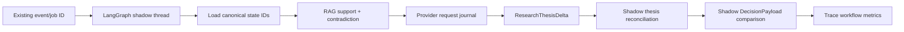

# Trade AI v12 R9.1 - Mature Investment Office Live Convergence

Date: 2026-08-23  
Audit branch: `audit/r9-1-live-maturity-langgraph`  
Starting source: `origin/main@9dfe437f6e161cb2b6c9ed2c983e23b9fa9de1b7`  
Authority: `READ_ONLY_ADVISORY`  
`MEMORY_BEHAVIOR_INFLUENCE=0`  
Final status: `HOLD_CI_INFRA`

## Executive decision

Trade AI is not a live 75-80% autonomous investment office. Measured live maturity is **35/100**. The sequential autonomous-advisory stack (#461-#472) remains open and undeployed. GitHub Actions is blocked before job execution by an account payment/spending-limit condition. This is `CI_INFRASTRUCTURE_BLOCKED`, not a proven code failure, but branch protection cannot be satisfied while jobs do not execute. No PR was merged, no release was deployed, no runtime root was changed, and Temporal T1 was not started.

The live system has useful portfolio, CIO, research, trace, and shadow-memory surfaces. It does not yet have the required canonical portfolio-brain state objects, automatic live research-to-thesis circulation, verified investable cash, governed canon claims, complete feedback/outcome observation, or converged runtime roots. Live NOC, SCHG, CSCO, and ANET cards all return `RESEARCH_REQUIRED` without a thesis version.

LangGraph is **not production-ready for Trade AI**. Main contains a feature flag and a deterministic complexity gate, but no LangGraph dependency, graph, checkpointer, or live pilot. Worse, the gate computed `NOT_REQUIRED` from 7,059 live traces only because the trace schema emits none of the gate's complexity fields. That verdict is reclassified as `UNMEASURED`. A bounded shadow pilot can be reconsidered only after instrumentation and Python compatibility are proven.

MATURITY_IMPACT: NONE. This audit does not activate capability.

## Evidence precedence

Claims use this order: live measurement, current source, newest dated closeout, historical documentation. Evidence artifacts:

- `docs/_evidence/r9_1/R9_1_SOURCE_CI_RUNTIME_INVENTORY.json`
- `docs/_evidence/r9_1/LANGGRAPH_STATE_MEMORY_RETRY_ROUTING_AUDIT.json`
- `docs/_evidence/r9_1/R9_1_LIVE_MATURITY_SCORECARD.json`
- `docs/_evidence/r9_1/LIVE_BROWSER_ACCEPTANCE.json`
- `docs/_evidence/r9_1/cio-live.png`
- `docs/_evidence/r9_1/advisory-live.png`

## Starting state

| Item | Measured state |
|---|---|
| `origin/main` | `9dfe437f6e161cb2b6c9ed2c983e23b9fa9de1b7` |
| live CURRENT | `5e91225a1186659de3cfd65096e037e774506e7f` |
| CURRENT release | `5e91225a-main-exact-phase2-20260821-193607` |
| worktrees | 166 total; 67 dirty |
| advisory/research root drift | 217 rebuild/hybrid unit or cron entries |
| Temporal production | none |
| local generative GPU | `gemma3:12b`, 100% GPU, stopping |

The portfolio server unit points directly to the exact CURRENT release for source and uses the rebuild virtual environment, so the tree audit classifies it `HYBRID`. The CIO Telegram unit points to the mutable `CURRENT` symlink and retained the same long-running process observed by the Temporal audit; the prior loaded old-release mismatch (`fe34482b...`) is not closed by a restart or new process proof.

## CI infrastructure gate

GitHub check run `97219526148` completed in seconds with this annotation:

> The job was not started because recent account payments have failed or your spending limit needs to be increased. Please check the 'Billing & plans' section in your settings

The same pre-job failure pattern affects required workflows across the open stack. Local tests cannot substitute for protected required CI.

Required operator action: the repository owner/organization must resolve the failed payment or increase the GitHub Actions spending limit/budget under **Billing & plans**, then rerun the exact required workflows. Merge/deploy remains prohibited until jobs actually execute and pass.

## Existing stack

All intended production PRs remain open and are based sequentially:

| PR | Exact head | Base | State |
|---:|---|---|---|
| 461 | `07225e5b7b91fa148e3d6876ee8f25c76b249226` | main `9dfe437f...` | open; CI infrastructure blocked |
| 462 | `767653eceef33a7896949bd6c7a10640cf3face9` | #461 | open; blocked |
| 464 | `70415dbcca39e3e99d9084a9c455f6db25d72eb4` | #462 | open; blocked |
| 465 | `6b504ce3307257128af4b8fe29715cccfd25c7bd` | #464 | open; blocked |
| 466 | `2c1ed2c945ac7f915bbb65f3535d6b95925bce61` | #465 | open; blocked |
| 467 | `3574f3cdb423a61bb5f8784e43b67ba1d3ee5a2d` | #466 | open; blocked |
| 468 | `55b306b35569bb1f67b1d69e9e62e1044c034127` | #467 | open; blocked |
| 469 | `82735ed99c9b766fe6595acc6b311e73a664b4b0` | #468 | open; blocked |
| 470 | `c9971a80c94e4cfac2279a50e12ebf6f997fb24c` | #469 | open; blocked |
| 471 | `2349a65b33a1eaed1c93dcf98a864a242ff31417` | #470 | open; blocked |
| 472 | `16616604635e8177930fc5bfbc7793247dba923a` | #471 | open; blocked |
| 473 | `454e90131cec9942c14200fc1efd31d5a7040ea4` | main | draft architecture/POC; `MATURITY_IMPACT: NONE` |

PR #463 (`c1b7931b...`) and PR #465 have identical stable patch ID `a1ad087dc3900222048bbcc1eba8c7f42a538767`. #465 fully supersedes #463's production-relevant patch while preserving #464 in its ancestry. #463 should be closed as superseded after the operator restores CI; it must not be merged in addition to #465.

## Live runtime source map

`scripts/ops_tree_pin_audit.py --json` measured:

| Surface | CURRENT | Rebuild | Hybrid | Other | Drift |
|---|---:|---:|---:|---:|---:|
| systemd user units | 1 | 47 | 28 | 85 | 75 |
| cron | 14 | 137 | 5 | 337 | 142 |
| combined | 15 | 184 | 33 | 422 | 217 |

This blocks exact-main operational maturity. The audit did not mutate units or cron. A controlled cutover still requires a reviewed exact-main release, backup/hash/diff, operator authorization, and natural-run proof per batch.

## Live maturity score

| Dimension | Live credit | Maximum | State |
|---|---:|---:|---|
| Data / financial truth | 6.0 | 10 | PARTIAL |
| Research / evidence | 5.0 | 10 | PARTIAL |
| Stateful thesis circulation | 5.0 | 15 | PARTIAL |
| Portfolio CIO brain | 3.5 | 15 | PARTIAL |
| Methodology / canon | 1.0 | 10 | SOURCE_REQUIRED |
| Feedback / outcomes | 2.0 | 10 | UNMEASURED_OBSERVATION_WINDOW |
| Proactive CIO | 3.5 | 10 | PARTIAL |
| Operator experience | 6.0 | 10 | PARTIAL |
| Operational integrity | 2.0 | 5 | DEGRADED |
| GPU / provider governance | 1.0 | 5 | HOLD |
| **Total** | **35.0** | **100** | **HOLD_CI_INFRA** |

The June `maturity_score_latest.json` value of 4.95/5 measures execution-control readiness, not autonomous investment-office maturity, and is not reused here.

## LangGraph audit

### What is actually present

Current main has:

- `LANGGRAPH_WORKER_PILOT=0` in `scripts/lib/agent_feature_flags.py`.
- `scripts/lib/langgraph_complexity_gate.py`, a pure metric calculator.
- tests for that calculator.
- ADR/documentation that defaults to `NOT_REQUIRED`.

Current main does not have `langgraph` or `langchain` in its dependency manifests, a `StateGraph`, functional entrypoint, checkpointer, Store, thread ID lifecycle, or a live LangGraph worker. The active virtual environment also has neither package installed.

Official LangGraph documentation describes it as low-level orchestration for long-running stateful agents, with checkpoints organized by threads, node/super-step persistence, interrupts, retries, and stores. It does not make side effects idempotent automatically. Tasks/nodes that call providers or write data must still use stable idempotency keys and recovery-safe boundaries. Sources reviewed 2026-08-23: [overview](https://docs.langchain.com/oss/python/langgraph/overview), [persistence](https://docs.langchain.com/oss/python/langgraph/persistence), [fault tolerance](https://docs.langchain.com/oss/python/langgraph/fault-tolerance), [interrupts](https://docs.langchain.com/oss/python/langgraph/interrupts), [functional API](https://docs.langchain.com/oss/python/langgraph/functional-api), and [graph migrations](https://docs.langchain.com/oss/python/langgraph/graph-api).

The current package reviewed is LangGraph 1.2.10. PyPI lists Python `>=3.10` and classifiers through Python 3.13; Trade AI's active environment is Python 3.14.4. Compatibility is therefore `UNPROVEN_PYTHON_3_14`, not assumed. [PyPI package record](https://pypi.org/project/langgraph/).

### Complexity-gate defect

The gate accepts fields such as `steps`, `branch_count`, `retry_count`, `durable_wait_count`, `resume_count`, `operator_interrupts`, `partial_failure_recovery`, and `state_loss_incidents`. Live `AgentRunTrace@v1` rows contain none of them.

Applying the gate to 7,059 rows/525 wakes produced all-zero metrics and `NOT_REQUIRED`. That is a missing-observability result. The corrected status is:

```text
LANGGRAPH_COMPLEXITY_GATE=UNMEASURED
reason=TRACE_SCHEMA_DOES_NOT_EMIT_GATE_INPUTS
```

Enhancement: add a versioned `workflow_metrics` object to traces, populated from actual scheduler/queue/runtime events. Missing fields must remain `UNMEASURED`; zero is valid only when an instrumented producer explicitly observed zero.

### State maturity

The custom `MvlRuntime` has good source-level controls: hash-chained events, transaction-scoped state, idempotent artifacts/tool calls, budgets, deadlines, and explicit checkpoints. It is limited to LAB/SHADOW persistence and is not the live autonomous advisory control plane.

Material gaps:

1. A flat completed trace is not a resumable graph checkpoint.
2. Failed/cancelled runs require a new immutable envelope; they do not resume from a failed node.
3. `MODEL_STARTED` commits before the provider call, then `MODEL_COMPLETED` commits after it. A provider success followed by DB failure leaves an ambiguous paid side effect with no universal provider-request journal.
4. The runtime has no typed per-node retry disposition, durable wait primitive, interrupt contract, or cross-process recovery metric.
5. Live traces cannot show which branch, retry, or partial recovery occurred.

LangGraph could improve step-level checkpoints, explicit state transitions, interrupts, and recovery inside one advisory worker. It would not replace canonical Trade AI stores, provider idempotency, job ownership, source-root governance, or Temporal's separate cross-process durable-workflow question.

### Memory maturity

Live durable memory evidence:

| Metric | Result |
|---|---:|
| durable rows | 284 |
| `ACTIVE` | 2 |
| `CANDIDATE` | 280 |
| expired / retracted | 1 / 1 |
| retrieval receipts | 6,062 |
| shadow wakes compared | 2,867 |
| `DecisionPayload@v1` count | 6,080 |
| retrieval rate | 1.0 |
| memory-attributable action flips | 0 |
| truth override attempts | 0 |
| operator rejection recall | UNAVAILABLE |
| promotion | NOT_PROMOTED |

The authority boundary is correct: memory is non-authoritative context and behavior influence remains zero. The durable provider uses JSONL + `flock`, provenance/admission controls, TTLs, adversarial scans, counter-memory, and truth override protection.

Gaps:

- Retrieval is lexical/confidence/recency and repeatedly selects the same top records for unrelated wakes.
- The shadow measure proves retrieval, not decision usefulness or operator-rejection recall.
- `ACTIVE` memory remains non-authoritative; it must not be confused with confirmed investment policy.
- Real linked feedback/outcome history is too short for promotion evidence.
- LangGraph Store must not be added as a second memory truth store. If piloted, graph state references existing memory IDs only.

### Retry maturity

`scripts/llm_net.py` retries 429/5xx, connection errors and timeouts up to three total attempts with exponential delays. Provider policy blocks some hard cost/policy failures, and Hermes has a circuit breaker. Those controls are fragmented.

Gaps:

- HTTP helper, provider, queue, cron, systemd, and fallback retries can multiply.
- There is no canonical exception taxonomy or `RetryDisposition@v1` shared by all producers.
- `llm_net` has no jitter, shared attempt budget, `Retry-After` handling, or max elapsed deadline.
- Retry events are not linked to decision/provider request IDs in `AgentRunTrace`.
- `synthesis_retry` uses a timestamp job ID, which does not guarantee semantic request idempotency.
- Ambiguous provider timeouts are not universally protected by reserve-before-call/finalize-after-call journaling.
- Hard-failure vocabularies differ: `COST_CAP`, `BUDGET_EXHAUSTED`, `GLOBAL_CAP`, and policy marker variants.

Enhancement: first ship one typed retry registry outside LangGraph. It must define retryable/non-retryable errors, max attempts, elapsed deadline, jitter, circuit-breaker interaction, and a stable provider request key. LangGraph `RetryPolicy` may then adapt that registry at node boundaries; it must not invent a second policy.

### Routing maturity

Routing is split across `llm_router.py`, `llm_lane.py`, `llm_task_policy.py`, `agent_job_provider_policy.py`, agent routers, provider helpers, and direct Ollama callers. The local-model audit found:

```text
installed generative models = 6
active generative models    = 1
source references           = 171
cron callers                = 15
systemd callers             = 3
OpenClaw/config references  = 24
```

Specific correctness gaps:

- `llm_router` uses mutable function attributes for per-call task metadata, which can race under concurrent calls.
- daily-spend log parse errors fail open to `$0.00`.
- local judgment rollback flags retain hidden generative capability.
- comments/logging say GPU/local-primary while governed task tables are Flash-only.
- direct callers bypass the canonical routing graph.
- CIO live payload labels provider `deepseek-v4-pro`, while automatic routing policy is intended to be governed Flash; provenance and lane semantics are not singular.

PR #472 is the intended source-closure stack head, but it is neither CI-validated nor deployed. No local model can be removed until callers, processes, tests, and seven-day zero-call evidence meet the physical decommission gate.

### LangGraph recommendation

Decision: `NO_LANGGRAPH_PRODUCTION_ADOPTION`.

After base stability, a bounded `LANGGRAPH_MEASUREMENT_REPAIR_THEN_PILOT` may wrap one advisory worker only:



Pilot constraints:

1. Use an isolated supported Python 3.13 environment until 3.14 compatibility is proven.
2. Use a persistent Postgres checkpointer in an isolated schema; `InMemorySaver` is test-only.
3. Store IDs/versions, not raw research corpora or canonical financial truth, in graph state.
4. Use existing durable memory and domain stores; do not create LangGraph long-term memory truth.
5. Instrument actual waits, resumes, retries, branches, interrupts and recoveries.
6. No broker/order/stop/risk/2FA imports in the worker.
7. `MEMORY_BEHAVIOR_INFLUENCE=0` and no financial authority change.
8. No production activation while Temporal remains `NO_TEMPORAL` and T1 is not authorized.

## Operator policy

Live policy is not canonical enough for autonomous capital allocation:

- investment policy says maximum single position 8%;
- model portfolio says maximum single position 3%;
- desk thesis uses 12% and a 16.5% concentration fire threshold;
- model cash target is 5%; desk thesis cash-band minimum is 20%.

These are unresolved policy conflicts, not values an LLM may reconcile. `OperatorInvestmentPolicy@v1` is absent. Required fields still need explicit operator confirmation: cash range/reserve, investable vs reserved cash, sleeve ranges, account-location/tax constraints, liquidity/withdrawal needs, benchmark, concentration hierarchy, time horizon, excluded instruments, and future capital needs.

## Portfolio state

Live `/api/v3/cio` evidence:

| Field | Result |
|---|---|
| total value | `$1,283,600.72` |
| holdings count | 34 |
| total cash | `$578,111.14` |
| cash percent | `45.0%` |
| cash truth | `PARTIAL` |
| cash source | holdings-derived, not verified broker buying power |
| equity target / actual | `75% / 55%` |
| cash target / actual | `5% / 45%` |
| conflicted advisory rows | 13 |

The capital condition is material, but verified investable cash is not established. No autonomous `CashDeploymentSituation@v1` or `CapitalDeploymentPlan@v1` may treat all `$578,111.14` as deployable.

## Market context and seasonality

The UI shows `risk on trend 33%` and VIX 14.9, but there is no canonical `MarketContextState@v1`. The live rotation domain returns `data_quality=0`, null 1m/3m/6m returns, and a default score of 50 for every sector/industry row. The portfolio is 78.2% funds/ETFs while valuation coverage is only 21.8%, so market/style conclusions are incomplete.

No `SeasonalityState@v1` was found on main or #472. There is no live Python-computed benchmark/sector/holding seasonal state with sample sizes. Seasonality maturity is `UNMEASURED`.

## Portfolio thesis and capital plan

Live `desk@v5` is a useful governing desk statement, last published/reviewed 2026-08-12. It is not `CIOPortfolioThesis@v1`: it lacks versioned portfolio-state/market/seasonality/methodology/feedback/outcome references, explicit counter-thesis, sleeve postures, governed horizons, and deterministic research gaps.

No canonical `PortfolioThesisDelta@v1`, `CashDeploymentSituation@v1`, `CapitalDeploymentPlan@v1`, or derived `CIOBrainSnapshot@v1` exists on main or #472. Existing CIO cards are not a substitute for those contracts. Therefore:

```text
CAPITAL_PLAN.generated=false
CAPITAL_PLAN.material=true
CAPITAL_PLAN.blocker=POLICY_CONFLICT_AND_UNVERIFIED_INVESTABLE_CASH
```

`HOLD_CASH` remains a valid future plan result, but no new plan is claimed here.

## Live learning-loop acceptance

Read-only live symbol-card results:

| Symbol | State | Version | Core thesis | Result |
|---|---|---|---|---|
| NOC | `RESEARCH_REQUIRED` | null | `DATA_UNAVAILABLE - no living symbol thesis` | FAIL |
| SCHG | `RESEARCH_REQUIRED` | null | `DATA_UNAVAILABLE - no living symbol thesis` | FAIL |
| CSCO | `RESEARCH_REQUIRED` | null | `DATA_UNAVAILABLE - no living symbol thesis` | FAIL |
| ANET | `RESEARCH_REQUIRED` | null | `DATA_UNAVAILABLE - no living symbol thesis` | FAIL |

The API's `what_changed` text says “LIVE mint” or “THESIS_CONFIRMED,” but the same payload has no version and no living thesis. That contradiction is a presentation/provenance defect. The required natural golden loops and identical-evidence replay are not live-proven.

## Canon and methodology

The canonical catalog contains 21 books, one book chapter, and 12 papers. All 34 are `NOT_FOUND_IN_FILE_LIBRARY` and `SOURCE_CLAIM_INCOMPLETE`. No claim, reviewed claim, shadow methodology, or ratified advisory methodology receives maturity credit.

The exact lawful acquisition queue is `docs/ops/CANON_SOURCE_ACQUISITION_QUEUE_2026-08-23.md`. No book content was invented or downloaded.

## Feedback and outcomes

Live memory shadow has broad trace/retrieval coverage but operator rejection recall is unavailable. The legacy `CIOOutcomeMaturity@v1` file has two matured disposition items and zero eligible runs; it is not the new frozen/benchmarked `OutcomeRecord@v1` proof. The #461-#472 stack implements feedback/outcome contracts in source, but it is not deployed.

Status:

```text
real decision-linked feedback maturity = UNMEASURED_OBSERVATION_WINDOW
frozen predictions                    = not live-proven
benchmarked outcomes                  = not live-proven
lesson candidates                     = not live-proven from OutcomeRecord@v1
memory truth overrides                = 0
```

## Proactive CIO

The system detects situations and shows CIO plans/notifications, but it does not yet build a proactive capital review from verified policy, verified investable cash, canonical market/seasonality states, living symbol theses, and ratified methodology. The current high-cash state should generate a governed review after policy/cash blockers close; this audit does not manufacture or send one.

## Command Center

Playwright against live localhost returned HTTP 200 for CIO and Advisory pages. Both render and are usable. Browser acceptance fails the R9.1 target because:

- no consolidated CIO Brain experience exists;
- source pin, loaded pin, process start, cache age and pin match are absent from served payloads/pages;
- desk health is `DEGRADED`;
- watch and opinion inputs are expired;
- 13 rows are data-conflicted;
- NOC and the other acceptance symbols lack living thesis versions.

Screenshots are stored under `docs/_evidence/r9_1/`.

## GPU status

Physical decommission is not ready. Installed generative models: `gemma3:4b`, `gemma3:27b`, `gemma3-overnight`, `gemma3:12b`, `qwen3:8b`, and `gemma3:12b-ctx4k`. `gemma3:12b` remained resident/stopping on the B50. Two embedding models are also installed.

The measured blockers are 171 source references, 15 cron callers, three systemd callers, 24 OpenClaw/config references, one active generative model, no seven-day zero-call proof, and no embedding acceptance. No model was removed.

Final GPU state remains `UNRESOLVED_HOLD`, not `EMBEDDINGS_ONLY` or `DISABLED`.

## Temporal

Temporal T0 local POC remains passed. Production choice remains `NO_TEMPORAL` (82.20 vs unmeasured-cloud-cost 81.86). T1 NOC `OLD_WRITE / TEMPORAL_SHADOW` is not started because its entry gates are not met. No Temporal Cloud resource was provisioned and the historical T0 report was not rewritten.

LangGraph and Temporal solve different scopes: a bounded LangGraph pilot could improve state/checkpoint semantics inside an agent worker; Temporal is the separately evaluated durable cross-process workflow service. Neither is authorized as production infrastructure by this audit.

## Tests and validation

Performed:

- exact source, PR and patch-ID verification;
- GitHub check-run/annotation inspection;
- live cron/systemd root inventory;
- live `/api/v3/advisory`, `/api/v3/cio`, and four symbol-thesis API reads;
- live AgentRunTrace complexity-gate execution;
- durable-memory record/retrieval/shadow measurement;
- local-model decommission audit and Ollama inventory;
- Playwright Chromium live screenshots;
- JSON validation and documentation checks before commit.

Local test results:

- state/memory/LangGraph/routing: `137 passed, 1 skipped`;
- research governance/no-broker/provider-cost/release-readiness: `28 passed`;
- one pre-existing `SyntaxWarning` from an invalid `\$` escape was reported by the no-broker scanner and did not fail the suite.

Not performed as acceptance:

- required GitHub Actions, because infrastructure prevented job start;
- stack merge or exact-main deploy;
- natural post-deploy research/thesis/outcome runs;
- Temporal T1;
- destructive GPU removal;
- broker/order/stop/risk/2FA mutation.

## Required convergence sequence

1. Restore GitHub Actions billing/spending capacity and rerun required workflows.
2. Sequentially review/reconcile/merge #461, #462, #464-#472; close #463 as superseded.
3. Build and deploy one immutable exact-main release; prove every advisory/CIO process loaded SHA.
4. Converge advisory/research runtime roots with authorized, reversible batches.
5. Prove natural NOC/SCHG/CSCO/ANET/holding loops and no-new-info replay.
6. Land M1-M7 portfolio-brain contracts in reviewable current-main PRs.
7. Acquire lawful canon sources and govern claims.
8. Complete feedback/outcome observation windows.
9. Repair the LangGraph complexity measurement; only then consider a bounded shadow pilot.
10. Finish seven-day local-generative zero-call proof, embedding acceptance, and physical removal.

## Remaining P0

- GitHub Actions billing/spending block prevents required CI from executing.
- Live autonomous stack is unmerged/undeployed.
- NOC and required symbols have no live thesis version.
- Served source-pin/process truth is absent; CIO Telegram loaded-source mismatch remains unresolved.
- 217 advisory/research runtime-root drift entries remain.
- Local generative callers/models/process remain.

## Remaining P1

- Resolve policy contradictions and create confirmed `OperatorInvestmentPolicy@v1`.
- Verify broker buying power/reserved cash and create `PortfolioState@v1`.
- Build market, seasonality, portfolio-thesis/delta, cash-situation and capital-plan contracts.
- Complete real feedback/outcome linkage and observation.
- Acquire lawful canon text and produce reviewed claims.
- Unify retry taxonomy, provider request journal and routing graph.
- Repair LangGraph trace metrics and Python compatibility proof.

## Remaining P2

- Improve fund/ETF look-through and valuation coverage.
- Add workflow diagnostics/deep links after the underlying state is reliable.
- Re-score Temporal after a measured T1 only if base stability gates pass.

## Result packet

```yaml
TRADE_AI_R9_1_LIVE_INVESTMENT_OFFICE_RESULT:
  SOURCE:
    starting_main: 9dfe437f6e161cb2b6c9ed2c983e23b9fa9de1b7
    final_main: 9dfe437f6e161cb2b6c9ed2c983e23b9fa9de1b7
    starting_CURRENT: 5e91225a1186659de3cfd65096e037e774506e7f
    final_CURRENT: 5e91225a1186659de3cfd65096e037e774506e7f
    pin_match: portfolio-server configured exact CURRENT; served pin fields absent
    stale_processes: CIO Telegram old-loaded-source finding unresolved
  CI:
    infrastructure_status: CI_INFRASTRUCTURE_BLOCKED
    required_workflows: aif-financial-senses-integration, provider-cost, cio-hardening, release-readiness, plus stack-required suites
    all_executed: false
    all_green: false
  EXISTING_STACK:
    PR461: open@07225e5b
    PR462: open@767653ec
    PR464: open@70415dbc
    PR465: open@6b504ce3
    PR466: open@2c1ed2c9
    PR467: open@3574f3cd
    PR468: open@55b306b3
    PR469: open@82735ed9
    PR470: open@c9971a80
    PR471: open@2349a65b
    PR472: open@16616604
    PR463_disposition: superseded by PR465; identical stable patch ID; not closed/merged
  LIVE_LOOP:
    NOC: FAIL_RESEARCH_REQUIRED_NO_VERSION
    SCHG: FAIL_RESEARCH_REQUIRED_NO_VERSION
    CSCO: FAIL_RESEARCH_REQUIRED_NO_VERSION
    ANET: FAIL_RESEARCH_REQUIRED_NO_VERSION
    no_new_info_replay: NOT_LIVE_PROVEN
  OPERATOR_POLICY:
    version: no OperatorInvestmentPolicy@v1
    confirmed_fields: legacy investment/model policy fields only
    missing_fields: canonical cash range/reserve, concentration precedence, tax/location, liquidity, future needs
  PORTFOLIO_STATE:
    total_value: 1283600.72
    investable_cash: UNVERIFIED
    cash_pct: 45.0
    target_cash: conflicting 5% model vs 20% desk minimum
    deviation: +40pp against model target, subject to cash verification
    truth_quality: PARTIAL
  MARKET_CONTEXT:
    regime: UI risk_on_trend_33pct; no MarketContextState@v1
    rates: no canonical current state
    valuation: 21.8% direct-equity coverage
    breadth: no canonical current state
    volatility: VIX 14.9 UI value
    seasonality: UNMEASURED
    forward_calendar: no canonical state
  PORTFOLIO_THESIS:
    id: desk
    version: desk@v5
    posture: defensive_observe
    cash_thesis: optionality/stage; conflicts with model 5% target
    equity_thesis: not canonical
    fixed_income_thesis: not canonical
    counter_thesis: missing required structured counter-thesis
    what_changed: no PortfolioThesisDelta@v1
    gaps: policy, state, market, seasonality, methodology, outcomes
  CAPITAL_PLAN:
    generated: false
    material: true
    do_now: POLICY_REQUIRED
    pullback: POLICY_REQUIRED
    wait: VERIFY_CASH_AND_POLICY
    research_first: market/seasonality/sleeve gaps
    hold_cash: valid future conclusion; not newly generated
    next_review: after policy and verified cash
  CANON:
    catalog_total: 34
    source_text_present: 0
    missing_sources: 34
    claims_extracted: 0
    reviewed: 0
    shadow: 0
    ratified: 0
    current_plan_claim_refs: 0
  FEEDBACK:
    real_rows: UNMEASURED_OBSERVATION_WINDOW
    preference_candidates: memory has 280 candidates; not equivalent to confirmed preferences
    confirmed_policy_updates: 0
  OUTCOMES:
    frozen: NOT_LIVE_PROVEN
    matured: NOT_LIVE_PROVEN_FOR_OUTCOME_RECORD_V1
    benchmarked: NOT_LIVE_PROVEN
    lesson_candidates: NOT_LIVE_PROVEN
  PROACTIVE_CIO:
    situations_detected: existing surfaces active
    capital_reviews: no canonical verified-cash review
    delivered: 0 from R9.1
    suppressed: existing unchanged_replay receipts observed
    suppression_reasons: unchanged_replay
  COMMAND_CENTER:
    brain: NOT_IMPLEMENTED
    portfolio_thesis: legacy desk@v5 only
    capital: existing tab, no CapitalDeploymentPlan@v1
    methodology: catalog only
    learning: partial shadow surfaces
    source_truth: served pin/process fields absent
    browser_pass: false
  GPU:
    installed_generative: 6
    active_generative: 1
    source_callers: 171
    cron_callers: 15
    systemd_callers: 3
    OpenClaw_callers: 24
    zero_call_days: 0 proven
    embedding_acceptance: NOT_PASSED
    final_mode: UNRESOLVED_HOLD
  TEMPORAL:
    T0: PASSED_LOCAL_POC
    T1: NOT_STARTED
    current_production_choice: NO_TEMPORAL
    measured_no_temporal_score: 82.20
    measured_temporal_score: 81.86 with cloud cost unmeasured
    cloud_provisioned: NO
  RUNTIME:
    CURRENT_units: 1
    rebuild_units: 47
    hybrid_units: 28
    other_units: 85
    advisory_research_drift: 217 combined unit/cron entries
  MATURITY:
    before: approximately 35-40 claimed
    after: 35 measured live; audit capability only
    data_truth: 6/10
    research: 5/10
    thesis: 5/15
    portfolio_brain: 3.5/15
    methodology: 1/10
    feedback_outcomes: 2/10 UNMEASURED_OBSERVATION_WINDOW
    proactive_cio: 3.5/10
    operator_experience: 6/10
    operational_integrity: 2/5
    GPU: 1/5
    total: 35/100
  AUTHORITY:
    READ_ONLY_ADVISORY: true
    MEMORY_BEHAVIOR_INFLUENCE: 0
    broker_mutations: 0
    order_mutations: 0
    stop_mutations: 0
    risk_mutations: 0
    2FA_mutations: 0
    trading_authority_change: 0
  FINAL_STATUS: HOLD_CI_INFRA
```
