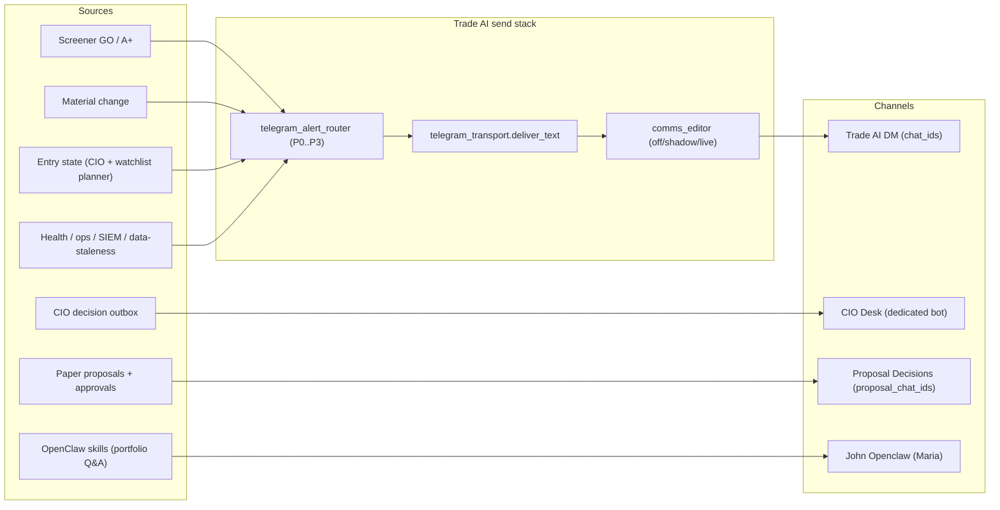

# Phase 1 — Channel Inventory & Source Mapping

Status: ACTIVE
as_of: 2026-09-16T16:15:00-04:00
Measured at: origin/main `940425b73` · `[CODE]` reads of `scripts/`; `[DOC-CLAIM]` for historical audits
See also: `02_ROUTING_GOVERNANCE_PROPOSAL.md` · `03_DELIVERY_RELIABILITY.md`

## 1. Channel purpose, origin, and data sources

### CIO Channel — CIO Desk
- **Purpose:** CIO decision cards (`ADD/TRIM/EXIT/RE_ENTER/ROTATE/DEPLOY_CASH/RAISE_CASH`),
  act-now dispositions (ACK/DEFER/DONE/REJECT/RATE), and CIO Q&A.
- **Origin:** `lib/cio_notification_signal.py` (delivery classes + lineage), CIO delivery
  timer, CIO material-scan timer, `lib/cio_telegram_keyboard.py` (signed action buttons).
- **Data sources:** CIO decision semantics (`lib/cio_decision_semantics.py`), desk snapshots,
  portfolio state — house facts only.
- **Generation:** automated outbox + converse (hybrid). Converse replies are model-assisted
  but guarded by `reply_provenance` and `READ_ONLY_ADVISORY`.
- **Bots/services:** dedicated CIO bot; `tradeai-cio-telegram.service`.

### Trade AI DM — generic alerts (`chat_ids()`)
- **Purpose:** operator's direct 1:1 chat for actionable market + capital-risk interrupts
  plus curated digests.
- **Origin:** ~182 `send_telegram()` call sites fan into one chokepoint
  `telegram_transport.deliver_text` `[CODE]` `scripts/telegram_alert.py:500`.
- **Producers (sampled, non-exhaustive):** `screener_go_alerts.py` (GO/A+),
  `notify_material_change.py` (material change), `watchlist_entry_planner.py` (ENTRY),
  `stop_health_check.py` / `stop_drift_alert.py` (protection), `p1_digest_sender.py`,
  `send_morning_brief.py`, `system_health_alerts.py`, `data_plausibility_monitor.py`,
  `research_lane_health.py`, `telegram_cio_summary.py`.
- **Data sources:** trade_ai_scans (scanner), material_change store, entry plans,
  ticker_prices, risk/stop state, health/lane registries.
- **Generation:** automated (cron + systemd timers); digests are assembled then sent.
- **Routing:** `telegram_alert_router.classify_alert` → `P0_INTERRUPT / P1_DIGEST /
  P2_DASHBOARD_ONLY / P3_LOG_ONLY` `[CODE]` `scripts/telegram_alert_router.py:164`.

### Proposal Decisions group (`proposal_chat_ids()`)
- **Purpose:** paper-trade proposals and their approvals only.
- **Origin:** `send_telegram_proposal_alert.py` + `telegram_proposal_alert_policy.py`
  (inline Approve/Reject/½×/2×/More Info), settled by the callback poller.
- **Data sources:** `paper-proposals` / proposal registry rows.
- **Generation:** automated; callbacks handled by `run_telegram_callback_poller.py`.
- **Guard:** `tests/test_tg_chat_routing_20260914.py` asserts generic broadcasters never ask
  for `proposal_chat_ids()` `[CODE]`.

### John Openclaw Channel — OpenClaw (`@bigjohn_openclaw_bot`)
- **Purpose:** personal assistant / portfolio Q&A / skills, **not** the Trade AI alert bus.
- **Origin:** OpenClaw gateway, Maria agent binding (`route` → `agentId: maria`).
- **Data sources:** OpenClaw skills — `tradeai-readonly` (portfolio-today, stops-today,
  CC-mirror hub commands), `tradeai-watchlist` (free Grok/ChatGPT opinion), wealth/ops skills.
- **Generation:** conversational (model), tool-exec backed; hybrid with deterministic skills.
- **Deps:** `openclaw-gateway.service` (:18789), OAuth proxies `:8645`/`:8646`.
- **Reference:** `[DOC-CLAIM]` `docs/project/project_openclaw.md` (2026-07-09 snapshot).

## 2. Automation vs manual vs hybrid

| Channel | Mode |
|---|---|
| CIO Desk | hybrid — automated decision cards + converse replies |
| Trade AI DM | automated (scheduled) + operator-initiated `/` commands |
| Proposal Decisions | automated + button callbacks (operator tap) |
| John Openclaw | conversational (model) + deterministic skills |

## 3. Dependencies / integrations

- Telegram Bot API via `telegram_transport` (single HTTP chokepoint; Markdown→HTML retry,
  `link_preview_options`, thread_id support).
- Comms Editor at the chokepoint (`off`/`shadow`/`live`; host mode file `live`).
- Callback poller (single `getUpdates` consumer; no HTTP 409 collision).
- CIO_TELEGRAM_INTERDICT + `_interdicted()` gate (transport-level).
- OpenClaw gateway (separate stack; its own bindings/skills).
- Secret-backed chat IDs — **never printed in docs**; this package uses logical names only.

## 4. Overlap / duplication

- **Same bot, two chats:** `tradeai_bigjohn718_bot` serves both the DM and Proposal Decisions
  group; the 09-14 routing split fixed *broadcast* fan-out but the operator may still perceive
  them as one "Trade AI" stream.
- **Historical duplication:** 2026-07-28 audit measured 2,851 within-chat exact duplicates
  (21.9%) and 60 cross-chat duplicates in a 7-day window `[DOC-CLAIM]`
  `docs/ops/alerts/telegram_notification_normalization_2026_07_28/...`.
- **OpenClaw mirrors CC:** Maria's `tradeai-readonly` hub commands map 1:1 to CC v3 pages —
  intentional overlap (a read mirror), not a duplicate alert source.
- **CIO vs DM:** CIO decision content is currently the *only* channel with a strong
  "CIO-origin only" intent; the DM still carries a mix of market, protection, and ops.

## 5. Open items for the governance doc

1. Confirm the four-channel naming (DM vs Proposals split).
2. Decide whether a muted **Trade AI Ops** feed (T6, 2026-08-22) is still wanted.
3. Decide whether OpenClaw should ever receive Trade AI alerts (today: no).
