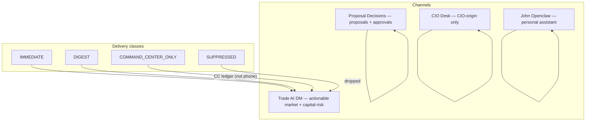

# Phase 2 — Message Routing & Governance Proposal

Status: PROPOSED (approval required before any producer retarget)
as_of: 2026-09-16T16:20:00-04:00
Measured at: origin/main `940425b73` · routing evidence `[CODE]`; historical intent `[DOC-CLAIM]`
See also: `01_CHANNEL_INVENTORY_SOURCE_MAP.md` · `06_IMPLEMENTATION_ROADMAP.md`

> **This is a proposal.** Nothing here changes routing until the operator approves it. The
> code split that already exists (DM vs Proposals) is unchanged by this document; the proposal
> governs *which message families belong where* and *what the CIO channel must never carry*.

## 1. Target architecture

## 2. Per-channel governance

### CIO Channel (CIO Desk)
- **Audience:** John (operator) — investment-office decisions only.
- **Required content:** CIO decision cards with DECISION FIRST → REASON → WHAT CHANGED →
  WHAT TO DO → INVALIDATION → NEXT REVIEW → EVIDENCE LINK (per
  `docs/cio/CIO_TELEGRAM_PRODUCT_STANDARD.md`).
- **Optional:** act-now disposition buttons, cash digest, re-entry calls.
- **Must NOT carry:** health/ops telemetry, "CIO Run Complete" markers, raw research
  updates, stop warnings, GO/scalp alerts. *(Your assumption — correct — is formalized here:
  this channel contains only CIO-origin / CIO-relevant content.)*
- **Rule:** if it did not originate in the CIO decision engine or a direct CIO answer,
  it does not go to CIO Desk.

### Trade AI Channels (DM + Proposals, split)
- **Trade AI DM — audience:** John; actionable market + capital-risk interrupts and one
  curated digest.
  - **IMMEDIATE (page the phone):** GO/A+ scalp, material change, ENTRY (CIO entry state),
    orphaned-stop / protection-failure / broker-auth-blocking (capital at risk).
  - **DIGEST (batched):** confluence flips, research updates, market-regime notes, routine
    health — one per window, not per event.
  - **COMMAND_CENTER_ONLY (no phone):** scanner WAIT/AVOID universe, paper lifecycle noise.
- **Proposal Decisions — audience:** John; proposals + approvals only.
  - Required: paper proposal + Approve/Reject/½×/2×/More Info keyboard.
  - Must NOT carry: holdings, stop, health (this was the 09-14 bug, now fixed and guarded).

### John Openclaw Channel
- **Audience:** John; personal-assistant / portfolio Q&A / skills.
- **Required:** on-demand answers to portfolio-today, stops-today, watchlist asks, CC hub
  mirror commands.
- **Must NOT carry:** Trade AI alert fan-out. If Trade AI needs OpenClaw, route a pointer,
  not the raw alert stream.
- **Assessment:** current content is largely aligned; the risk is *scope creep* where the
  assistant starts relaying alerts it should not own.

## 3. Required vs optional matrix

| Message family | CIO Desk | DM | Proposals | OpenClaw |
|---|---|---|---|---|
| CIO decision / act-now | **required** | optional (digest) | — | — |
| GO / A+ scalp | — | **required (IMMEDIATE)** | — | — |
| Material change | — | **required (IMMEDIATE)** | — | — |
| ENTRY (READY/NEAR) | — | **required (IMMEDIATE)** | — | — |
| Orphaned stop / protection | — | **required (IMMEDIATE)** | — | — |
| Paper proposal + approve | — | — | **required** | — |
| Confluence flip / research | — | optional (DIGEST) | — | — |
| Health / SIEM / reaper | — | optional (DIGEST or Ops) | **forbidden** | — |
| Portfolio Q&A | — | — | — | **required** |
| Scanner WAIT/AVOID | — | COMMAND_CENTER_ONLY | — | — |

## 4. Known duplicates / misplacements to resolve

1. **CIO "Run Complete" noise** — historical (86 of 95 CIO Desk messages in one audit);
   already removed by `lib/cio_run_worker.py` `[CODE]`; keep the gate.
2. **Health/stop in Proposal group** — fixed 09-14 (`tg_chat_ids`), pinned by test.
3. **DM vs CIO overlap on holdings/stop content** — DM currently carries stop/health; the
   proposal is to keep capital-risk interrupts in DM but push *routine* stop/health to a
   digest, and never to CIO Desk.

## 5. Routing rules (proposed, for approval)

1. **One channel per message family.** A producer targets exactly one channel; cross-posting
   is a defect, not a convenience.
2. **CIO Desk is CIO-origin only.** Enforced by review, not yet by code — a future gate could
   assert the CIO channel only receives `cio_notification_signal` output.
3. **IMMEDIATE is scarce.** Only capital-at-risk or operator-requested action. `material_change`
   is deliberately not in `CRITICAL_IMMEDIATE_TYPES` (keeps the critical channel readable).
4. **DIGEST is a window, not a queue.** One per window per family; unbounded digest = flood.
5. **No model decides routing.** Deterministic `classify_alert` / `route_event` only.
6. **Proposals never reuse the DM chat** and vice versa (`tg_chat_ids` already guarantees this).

## 6. Approval checklist

- [ ] Confirm channel naming (CIO Desk / Trade AI DM / Proposal Decisions / John Openclaw).
- [ ] Confirm CIO-origin-only rule for CIO Desk.
- [ ] Decide on muted **Trade AI Ops** feed (defer is acceptable).
- [ ] Approve IMMEDIATE / DIGEST boundaries above.
