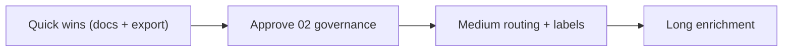

# Phase 6 — Implementation Roadmap

Status: ACTIVE (proposed work; nothing here is live until approved per `02`)
as_of: 2026-09-16T16:40:00-04:00
Measured at: origin/main `940425b73`
See also: `00_EXECUTIVE_SUMMARY.md` · `02_ROUTING_GOVERNANCE_PROPOSAL.md`

## Quick wins (docs + clarity, no producer retarget)

| # | Action | Owner | Effort |
|---|---|---|---|
| Q1 | Get the ChatExport onto ms01 and fill the 5-tier rubric counts in `04` | operator + agent | hours |
| Q2 | Fill the device/channel membership table in `03` §4 | operator | minutes |
| Q3 | Publish this package (PR + `docs/INDEX.md` pointer) | agent | small |
| Q4 | Confirm four-channel naming (CIO / DM / Proposals / OpenClaw) | operator | minutes |
| Q5 | Document the bot-per-channel matrix so devices are joined to the right chats | operator + agent | small |

## Medium-term (routing, after `02` approval)

| # | Action | Notes |
|---|---|---|
| M1 | Enforce **CIO Desk = CIO-origin only** (review gate, then code gate) | requires approval |
| M2 | Route routine health/SIEM/reaper out of the DM to DIGEST or a muted Ops feed | T6/T7 from 2026-08-22 |
| M3 | Add `held` / `not-held` label to GO/entry/material alerts | held-aware triage |
| M4 | Volume budget (e.g. 30/day, Ops exempt) with over → digest | T7 |
| M5 | Verify every actionable CC item has a one-tap Telegram path | mostly done; audit |

## Long-term (enrichment + coverage)

| # | Action | Notes |
|---|---|---|
| L1 | Scheduled **portfolio brief** (holdings, exposures, top movers, initiatives) to Telegram | closes the largest CC→Telegram gap |
| L2 | Earnings / dividend / rebalance calendar for held names to Telegram | present in CC, absent in Telegram |
| L3 | Delivery-reliability dashboard: per-device sync state vs server receipts | needs device inventory |
| L4 | Cross-channel dedupe ledger (one message_id across DM + Proposals + OpenClaw) | formalize idempotency |

## Sequencing

## Dependency

Everything empirical in Phases 3–4 waits on the ChatExport (`c:\Users\john\Downloads\Telegram
Desktop\ChatExport_2026-09-16 (3)\...rar`) being copied to ms01. The routing/governance/CC-gap
sections above are already grounded in code and runtime and do not block on it.
